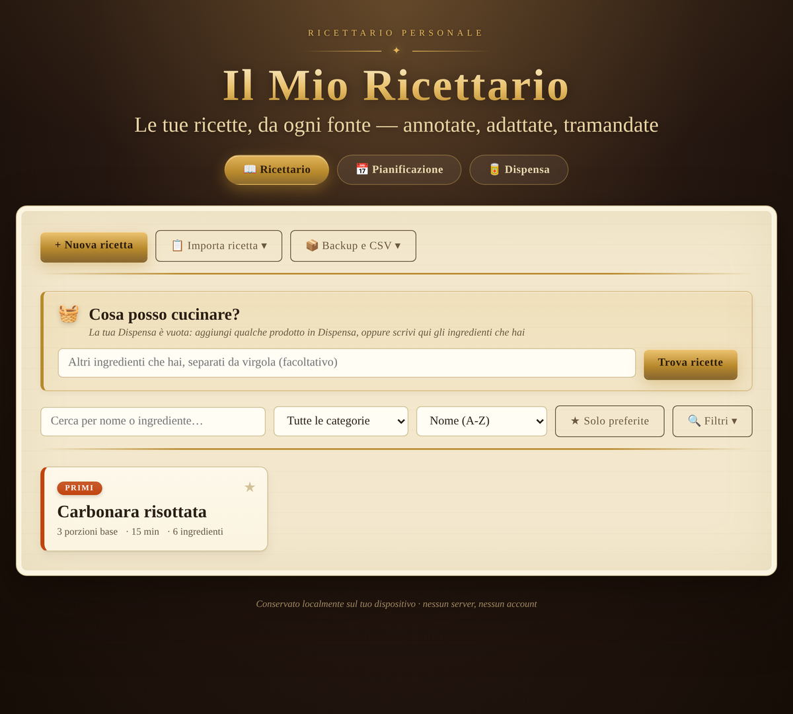

# 📖 Il Mio Ricettario

Un ricettario personale, digitale e privato, per organizzare le tue ricette da qualsiasi fonte. Nessun account, nessun server, nessun abbonamento: tutto resta sul tuo dispositivo.

<!--
Screenshot: aggiungi qui un'immagine dell'interfaccia (es. screenshot.png) e scommenta la riga sotto.

-->

## ✨ Caratteristiche

- **Passaggi con impostazioni robot facoltative**: scrivi ogni passaggio in modo normale; se usi un robot da cucina puoi aggiungere velocità, temperatura, tempo e modalità (Normale/Reverse/Turbo/Vapore) solo dove ti serve
- **Passaggi con impostazioni pentola a pressione facoltative**: pressione (con l'unità che preferisci: Bar, PSI o kPa), tipo di rilascio, durata del rilascio con timer dedicato e liquido minimo richiesto; le ricette che le usano si riconoscono da un'etichetta 🍲 automatica
- **Valori nutrizionali facoltativi per ingrediente** (Kcal, proteine, grassi, carboidrati, fibre, zuccheri, sale), inseriti manualmente e sommati automaticamente in un riepilogo per porzione che si scala da solo
- **Importa ricette da testo**: incolla il testo o il sorgente di una pagina web e il ricettario prova a riconoscere automaticamente nome, ingredienti e passaggi (usa i dati strutturati della pagina quando disponibili), pronti da correggere prima di salvare
- **Porzioni scalabili**: apri una ricetta e ricalcola automaticamente le quantità con un semplice +/−
- **Categorie colorate**: Primi, Secondi, Zuppe & Vellutate, Impasti & Pane, Salse & Sughi, Dolci, Infusi & Tisane, Altro
- **Tag dietetici**: Vegetariano, Vegano, Senza glutine, Senza lattosio, Piccante — assegnabili e filtrabili
- **Ricerca e filtri**: per nome, ingrediente, categoria, tag dietetici, ed escludendo ingredienti che non vuoi usare
- **"Cosa posso cucinare?"**: scrivi gli ingredienti che hai in casa (la lista resta salvata per la prossima volta) e vedi subito quali ricette puoi fare
- **Ricette preferite**: stellina per le ricette del cuore, con filtro dedicato
- **Cronologia di preparazione**: data dell'ultima volta e contatore di quante volte l'hai preparata
- **Foto per ricetta**
- **Modalità cucina guidata**: schermo intero, un passaggio alla volta, con timer integrato
- **Pianificazione settimanale in una vista dedicata**: più ricette (o prodotti dalla dispensa) per giorno, organizzate in fasce personalizzabili (colazione, pranzo, cena, spuntino o quelle che preferisci) con orario facoltativo per ciascuna
- **Lista della spesa scalabile**: genera la lista dalla settimana pianificata, con le quantità adattate al numero di persone che indichi
- **Stampa**: una singola ricetta, la lista della spesa, oppure l'intera settimana insieme alla lista della spesa
- **Backup**: esporta tutto (ricette, pianificazione, fasce pasto) in un file JSON e reimportalo quando vuoi
- **Importa/esporta CSV**: scarica le tue ricette in un file `.csv` apribile in Excel/Fogli Google, oppure importa ricette da un file CSV con lo stesso formato
- **Dispensa**: una sezione separata per tenere traccia di frutta, verdura, salumi e latticini/prodotti pronti che hai in casa, con quantità, valori nutrizionali e data di scadenza facoltativi — le scadenze vicine o passate sono evidenziate, e ogni prodotto si può anche pianificare direttamente come pasto nella settimana
- **Salvataggio locale**: tutti i dati restano nel browser tramite `localStorage`, nessuna connessione richiesta

## 🚀 Come si usa

1. Apri `index.html` in qualsiasi browser (Chrome, Firefox, Safari, Edge)
2. Premi **"+ Nuova ricetta"** per scriverne una tua, oppure **"📋 Importa ricetta"** per incollarla da un'altra fonte
3. Clicca su una ricetta per vederla in dettaglio, scalare le porzioni e seguire i passaggi
4. Usa il pannello **"Cosa posso cucinare?"** per trovare ricette in base a quello che hai, ed **"Escludi ingredienti"** per filtrare quello che non vuoi usare
5. Passa alla vista **"📅 Pianificazione"** per organizzare la settimana pasto per pasto e generare la lista della spesa
6. Passa alla vista **"🥫 Dispensa"** per tenere traccia di cosa hai in frigo e in cucina
7. Prima di cambiare browser o dispositivo, usa **"Esporta backup"** per salvare un file JSON con tutti i tuoi dati

Nessuna installazione richiesta: è un singolo file HTML autosufficiente. Consulta [GUIDA.md](GUIDA.md) per le istruzioni dettagliate su ogni funzione e [CHANGELOG.md](CHANGELOG.md) per la cronologia delle versioni.

## 🛠️ Tecnologie

- HTML, CSS, JavaScript vanilla (nessuna libreria esterna)
- `localStorage` per la persistenza dei dati
- Font Google: Cormorant Garamond e Crimson Pro

## 📌 Note

- I dati sono salvati solo nel browser in cui apri il file. Se cambi browser o dispositivo, i dati non si sincronizzano automaticamente: usa la funzione di esportazione/importazione backup per trasferirli.
- Il riconoscimento automatico nell'importazione da testo è un aiuto, non una garanzia: controlla sempre i campi prima di salvare.
- Il formato CSV è pensato per uno scambio semplice (una riga per ricetta): per un backup completo con pianificazione e fasce pasto usa il backup JSON.

## 📄 Licenza

Distribuito con licenza MIT — vedi il file [LICENSE](LICENSE).

---

*Progetto personale, nato come ricettario per un robot da cucina e diventato un ricettario generale per organizzare ricette da qualsiasi fonte.*
